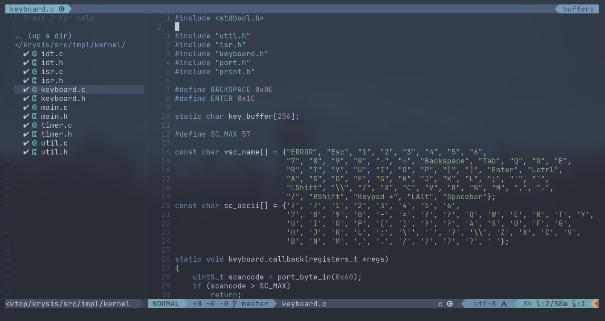

# My Dotfiles

Clone this repo to `~/.dotfiles`: `git clone https://github.com/idlidev/.dotfiles ~/.dotfiles`

### Setup

Copy all files in `~/.dotfiles/.config` to `~/.config`

Copy all files in `~/.dotfiles/.home` to `~`

Install the packages (use the install script if you're lazy like me :P)

`chmod +x ~/.dotfiles/install-pkgs-arch.sh`

`~/.dotfiles/install-pkgs-arch.sh`

Coming soon! :)
Inspired from [ShinyZenith's dotfiles](https://github.com/shinyzenith/old-xorg-dotfiles)

### Setup NeoVim config

Install vim-plug from [here](https://github.com/junegunn/vim-plug)

```sh
sh -c 'curl -fLo "${XDG_DATA_HOME:-$HOME/.local/share}"/nvim/site/autoload/plug.vim --create-dirs \
       https://raw.githubusercontent.com/junegunn/vim-plug/master/plug.vim'
```

Copy `~/.dotfiles/.config/nvim` to `~/.config/nvim`

Open NeoVim and do `:PlugInstall`

### Screenshots

#### DWM


#### BSPWM


#### NeoVim


