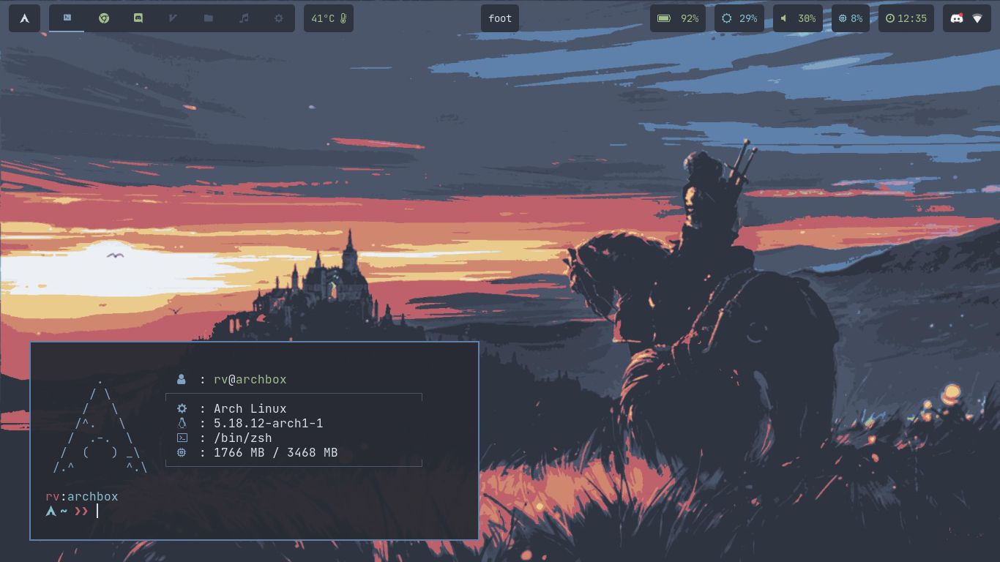

  

### Wayland dotfiles

-   Compositor: River
-   Bar: Waybar
-   Notification daemon: Dunst
-   Editor: NeoVim

### Setup

For setting up, see [SETUP.md](./.assets/SETUP.md)

### Screenshots

If you come across any issue, open an issue in this repo [here](https://github.com/rv178/.dotfiles/issues/new).
